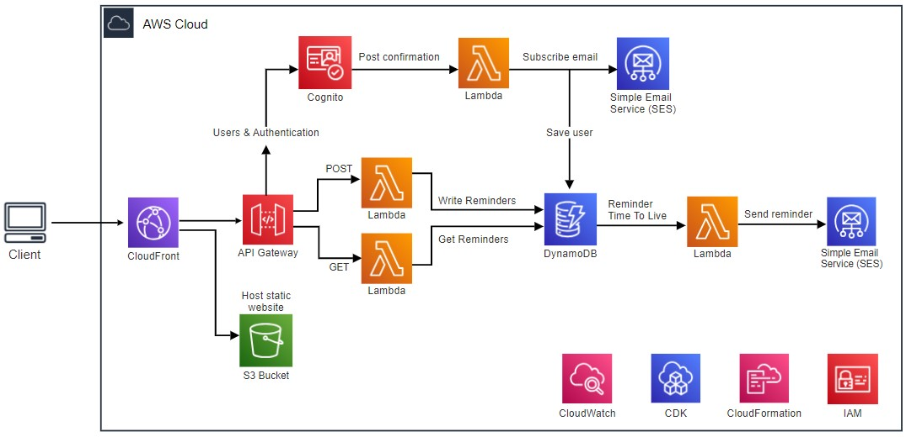
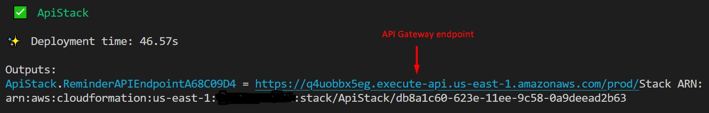
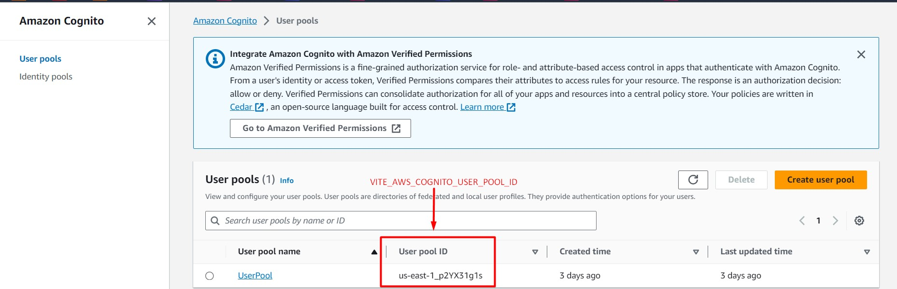
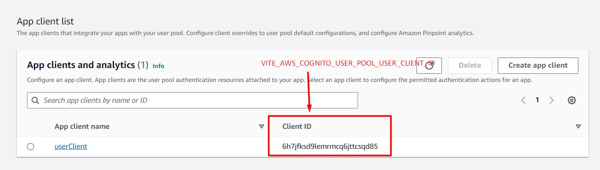
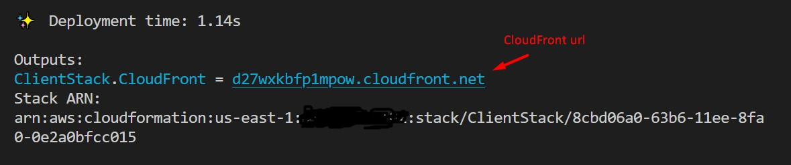
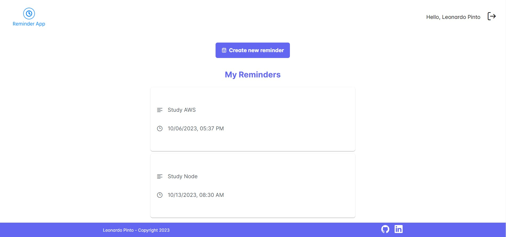

# :bell: Reminder App Serverless

## :bulb: About the project
This project consists of a reminder application, where users can register and create a reminder by specifying its content and date. Users are notified by email according to the reminder date.

## :computer: Software Engineering point-of-view
The objective of this project was to explore distinct AWS serverless services. By leveraging AWS CDK Cloud Development Kit (AWS CDK), it was possible to accelerate cloud development using TypeScript to model the application. 
The backend was totally developed using serverless services, such as Cognito, API Gateway, Lambda functions, DynamoDB, and Service Email Service (AWS). I was able to gain valuable hands-on experience in AWS services, such as creating a REST API and integrating Lambda functions using API Gateway, DynamoDB tables, using DynamoDB Streams to trigger Lambda functions, and implementing user authentication using Cognito.
The client was developed using Vue3 and deployed in an S3 bucket, which was accessed through a CloudFront distribution. 
I could also gain experience in monitoring applications using CloudWatch, and applying the least privilege concept using IAM. 

## Architecture Diagram



#### Disclaimer
:warning: Since this is a personal project that was developed to practice software engineering skills, the application was not developed focusing on implementing the required security and features for a production app. Also, the current architecture may not be the most suitable for the given problem, once that the choice of the services was a didactic approach.

## Running the application

### :exclamation: Cost alert

Depending on your AWS account tier, some resources used in this project may result in AWS costs. Please ensure you are using a free tier and limit the usage of the application only for testing purposes

### Requirements
* AWS Account
* [AWS CDK CLI](https://docs.aws.amazon.com/cdk/v2/guide/getting_started.html)
* Node / NPM
* Docker

### Deployment Instructions

1. Clone the repository and navigate to the created directory
```sh
  git clone https://github.com/leonardo-pinto/reminder-aws-serverless.git
```
2. In the root directory, change the filename of .env.example to .env, and complete with your aws account number and region to deploy the resources

```sh
  .env
  AWS_ACCOUNT_NUMBER=12345678
  AWS_REGION=your preferred region (e.g., us-east-1)
```

3. Bootstrap CDK to enable the deployment of resources using the following command in your terminal:
```sh
  cdk bootstrap aws://<ACCOUNT-NUMBER>/<REGION>
  // where ACCOUNT-NUMBER is your AWS account and REGION is the region in which you want to deploy your resources
```
For more information or troubleshooting, please refer to [AWS documentation](https://docs.aws.amazon.com/cdk/v2/guide/bootstrapping.html)

4. To deploy the Api stack, navigate to the root directory, and from the command line use the following:
```sh
  cdk deploy ApiStack
  // you can use the flag --require-approval never
  // so cdk won't ask you to confirm all the IAM resources that will be created
```
After the deployment is completed, you should get something similar to the next image, where you can find the newly generated API Gateway endpoint



5. Navigate to the client directory (./client), and update the .env.example file by changing the filename to .env and adding the required information

``` sh
VITE_AWS_ACCOUNT_ID= Same account used for the ApiStack
VITE_AWS_REGION= Same region used for the ApiStack
VITE_AWS_API_GATEWAY_URL= Should be the API Gateway endpoint obtained on step 4
VITE_AWS_COGNITO_USER_POOL_ID= Obtained from the Cognito using the AWS Console, as shown in step 5.1
VITE_AWS_COGNITO_USER_POOL_USER_CLIENT_ID= Obtained from the Cognito "App integration" tab using the AWS Console, as shown in step 5.1
```

5.1. VITE_AWS_COGNITO_USER_POOL_ID ->> Login into the AWS Console, and enter the Cognito service tab. The value can be found under the User Pool ID column, as shown in the next image


5.2 VITE_AWS_COGNITO_USER_POOL_USER_CLIENT_ID ->> Click in the UserPool, then in the App integration tab. Scroll down the page until you find the App client list. The required value is under the Client ID column, as shown in the next image


6. After the environment variables are set, install the project dependencies from the terminal
``` sh
     npm install
```

7. Use npm to build the Vue application
``` sh
  npm run build
```

8. After the build is complete, navigate back to the root folder, and use the following command to deploy the Client stack
``` sh
  cdk deploy ClientStack
  // you can use the flag --require-approval never
  // so cdk won't ask you to confirm all the IAM resources that will be created
```

After the deployment is completed, you should get something similar to the next image, where you can find the newly generated CloudFront distribution url


9. :boom: Now the application should be running on the CloudFront distribution url obtained in step 8. Optionally, you can find the url in CloudFront AWS Console




### Cleanup

1. To remove the deployed resource, navigate to the root directory and use the following command in your terminal
```sh
  cdk destroy --all
```

2. It is recommended to check on the AWS Console if all the resources were properly deleted.


